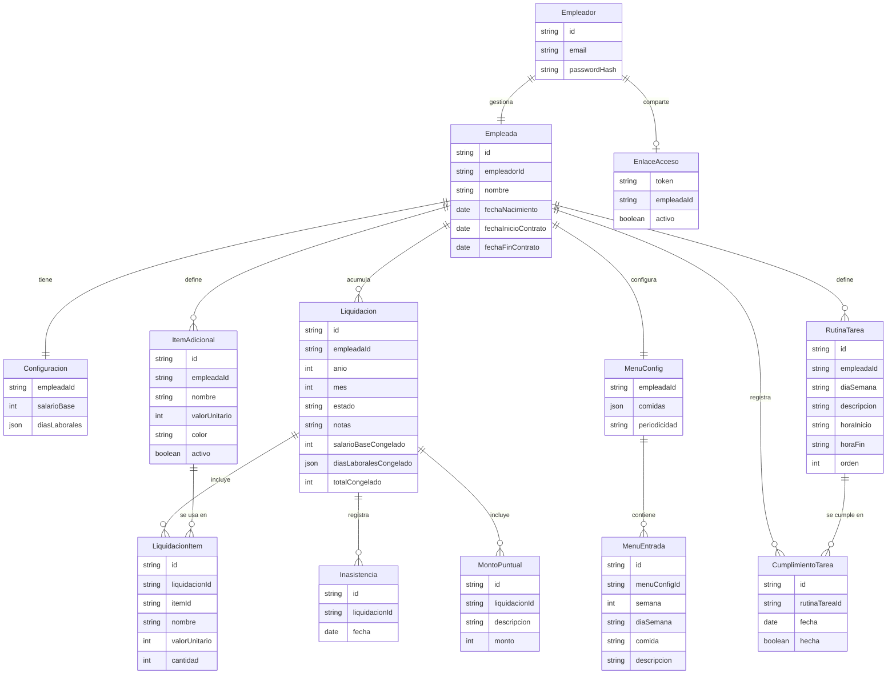

# Arquitectura: MiEmpleadApp

> Este documento describe la arquitectura técnica del proyecto. La fuente de verdad del **stack** vive en `.specture/stack.yml`; este documento explica cómo se organiza el código sobre ese stack.

## 1. Stack de Referencia

> Refleja el contenido de `.specture/stack.yml`. Si discrepan, `stack.yml` gana.

- **Backend:** TypeScript + Next.js (App Router: Route Handlers + Server Actions) sobre Node 20.
- **Base de Datos:** SQLite con Prisma (ORM); archivo `.db` en volumen persistente (ver ADR-002).
- **Frontend:** Next.js + shadcn/ui (Tailwind CSS), TypeScript. PWA.
- **Autenticación:** Auth.js (NextAuth).
- **Patrón Arquitectónico:** monolito modular (`modular-monolith`).
- **Estrategia de Módulos:** por feature (`by-feature`).
- **Despliegue:** VPS auto-gestionado con Docker, orquestado por Dokploy; instancia única, SQLite en modo WAL sobre volumen persistente (ver ADR-002).
- **Convenciones detalladas:** ver `.specture/conventions.md`.
- **Decisiones registradas (ADRs):** ver `.specture/decisions/` (`001-initial-stack.md`, `002-sqlite-self-hosted.md`).

## 2. Componentes de Alto Nivel

> Componentes lógicos, no archivos. El sistema es un único proyecto Next.js full-stack organizado por feature, con una separación estricta entre presentación, frontera HTTP, lógica de aplicación, dominio puro y persistencia.

### 2.1 Capa de Presentación (UI)
- **Responsabilidad:** renderizar la interfaz (páginas, calendario, formularios, checklists, menú) en español, consumiendo el backend exclusivamente a través del cliente tipado generado desde el contrato de API. Incluye el Design System (tokens + componentes base, shadcn/ui).
- **Entradas:** interacción del empleador y de la empleada (navegador / PWA).
- **Salidas:** llamadas HTTP a la Capa de Frontera (vía cliente tipado).
- **Datos que posee:** ninguno persistente (solo estado de UI y caché local para consulta offline de la empleada).
- **Dependencias permitidas:** Cliente tipado de API → Capa de Frontera. **Nunca** accede a Prisma ni a la base de datos.

### 2.2 Capa de Frontera (API — Route Handlers)
- **Responsabilidad:** exponer las operaciones del contrato (`api-contract.openapi.yaml`) bajo `/api/v1`. Valida autenticación y **rol** (empleador escribe; empleada solo lee y marca tareas), valida la entrada con Zod, traduce a llamadas de la Capa de Aplicación y serializa la respuesta o el envelope de error único.
- **Entradas:** HTTP desde la Capa de Presentación (y desde la PWA de la empleada con su token de acceso).
- **Salidas:** llamadas de función a la Capa de Aplicación.
- **Datos que posee:** ninguno.
- **Dependencias permitidas:** Capa de Aplicación, Autenticación. **No** contiene lógica de negocio ni accede a Prisma directamente.

### 2.3 Capa de Aplicación (Servicios por feature)
- **Responsabilidad:** orquestar los casos de uso (configuración, liquidación, menú, tareas, acceso). Coordina la Capa de Dominio (cálculo puro) con la Capa de Persistencia y aplica reglas de orquestación (estado borrador/cerrada, congelamiento al cerrar, unicidad mes/año).
- **Entradas:** llamadas de la Capa de Frontera.
- **Salidas:** llamadas a Dominio, Persistencia y al Servicio de Festivos.
- **Datos que posee:** ninguno (no tiene estado propio).
- **Dependencias permitidas:** Dominio, Persistencia, Servicio de Festivos.

### 2.4 Capa de Dominio (Lógica pura)
- **Responsabilidad:** la lógica de negocio sensible **como funciones puras y deterministas**: conteo de días laborales del mes, identificación de días dentro del periodo de contrato, cálculo del valor-día, descuento de inasistencias, subtotales de items y montos puntuales, total a pagar, y la construcción del modelo de días del calendario (tipo de cada día). No hace IO; recibe fechas, configuración y festivos como parámetros.
- **Entradas:** datos planos desde la Capa de Aplicación.
- **Salidas:** resultados calculados (desglose, calendario) de retorno.
- **Datos que posee:** ninguno.
- **Dependencias permitidas:** ninguna (capa más interna; sin dependencias de framework ni de IO).

### 2.5 Capa de Persistencia (Prisma)
- **Responsabilidad:** acceso a SQLite mediante un cliente Prisma único (`lib/db`). Módulos de acceso a datos por feature (estilo repositorio) para empleada/configuración, items, liquidaciones, menú y tareas.
- **Entradas:** llamadas de la Capa de Aplicación.
- **Salidas:** consultas/escrituras a SQLite (archivo en volumen persistente, modo WAL).
- **Datos que posee:** todas las entidades persistidas (§4).
- **Dependencias permitidas:** SQLite (vía Prisma).

### 2.6 Autenticación y Acceso (Auth.js + token de empleada)
- **Responsabilidad:** gestionar la sesión del **empleador** (Auth.js) y el **token de acceso de solo lectura** de la empleada (enlace compartido, revocable). Provee a la Capa de Frontera la identidad y el rol.
- **Entradas:** credenciales del empleador / token de la empleada.
- **Salidas:** contexto de identidad y rol para la autorización en la frontera.
- **Datos que posee:** cuenta del empleador y el registro del enlace/token de acceso.
- **Dependencias permitidas:** Persistencia.

### 2.7 Servicio de Festivos (Ley Emiliani)
- **Responsabilidad:** envolver una librería de festivos colombianos que aplica la Ley Emiliani y exponer "¿qué fechas son festivas en un mes/año?" a la Capa de Aplicación/Dominio.
- **Entradas:** mes/año (y zona horaria America/Bogotá).
- **Salidas:** conjunto de fechas festivas.
- **Datos que posee:** ninguno (cálculo determinista a partir de la librería).
- **Dependencias permitidas:** librería de festivos.

## 3. Patrones de Comunicación

| Origen | Destino | Mecanismo | Síncrono/Asíncrono | Notas |
|--------|---------|-----------|--------------------|-------|
| Presentación (UI) | Frontera (API) | HTTP (cliente tipado) | sync | Único canal UI→backend. Empleada envía su token de acceso; empleador usa cookie de sesión. |
| Frontera (API) | Aplicación | llamada de función | sync | La frontera valida auth/rol y entrada (Zod) antes de delegar. |
| Aplicación | Dominio | llamada de función | sync | Dominio puro: recibe datos planos, retorna cálculos. |
| Aplicación | Persistencia (Prisma) | llamada de función | sync | Única capa que toca la base. |
| Aplicación | Servicio de Festivos | llamada de función | sync | Provee fechas festivas del mes para el cálculo. |
| Frontera | Autenticación | llamada de función | sync | Resuelve identidad/rol de la petición. |

> **Detalle a nivel de endpoint:** esta tabla describe la comunicación a nivel **componente**. El contrato endpoint-por-endpoint (paths, métodos, request/response/error, `operationId`) vive en `docs/02-architecture/api-contract.openapi.yaml` (+ `api-contract.md`), fuente de verdad de la interfaz backend↔frontend. No se duplican endpoints aquí.

## 4. Modelo de Datos Inicial

> Diagrama Mermaid. Sin SQL/DDL (eso vive en migraciones de Prisma).

### Entidades principales

- **Empleador** — cuenta de autenticación (Auth.js). Gestiona exactamente una empleada.
- **Empleada** — ficha: nombre, fecha de nacimiento (cumpleaños), fechas de inicio y fin (opcional) de contrato.
- **Configuracion** — salario base (COP) y conjunto de días laborales de la semana.
- **EnlaceAcceso** — token de acceso de solo lectura de la empleada; revocable.
- **ItemAdicional** — concepto de pago adicional con valor unitario y color para el calendario.
- **Liquidacion** — pago de un mes/año concreto; estado `BORRADOR`/`CERRADA`; notas privadas; campos **congelados** (salario, días laborales, total) al cerrar (RN-09). Única por (empleada, año, mes).
- **Inasistencia** — fecha no trabajada de una liquidación.
- **LiquidacionItem** — uso de un item adicional en un mes: snapshot de nombre y valor unitario + cantidad (congela el valor, RN-09).
- **MontoPuntual** — pago suelto de un mes (descripción + monto).
- **MenuConfig / MenuEntrada** — comidas configurables + periodicidad; entradas por (semana del ciclo, día de semana, comida).
- **RutinaTarea** — tarea de la rutina por día de semana, con horario opcional y orden.
- **CumplimientoTarea** — marca histórica (hecha/pendiente) de una tarea en una fecha concreta.

> **Nota SQLite (Prisma):** SQLite no soporta `enum` nativos en Prisma, por lo que los campos de tipo enumerado (`estado`, `diaSemana`, `periodicidad`, tipo de día del calendario) se persisten como `String` y su dominio se valida en la frontera con Zod (los enums del contrato son la autoridad). Las estructuras como `diasLaborales` y `comidas` se almacenan como JSON. Los `id` son cuid/uuid (String).

## 5. Cross-Cutting Concerns

### 5.1 Autenticación y Autorización
- **Estrategia:** sesión del **empleador** vía Auth.js (cookie de sesión). La **empleada** accede con un **token de enlace** de solo lectura (revocable), presentado en cada petición.
- **Roles definidos:** `empleador` (lectura + escritura total), `empleada` (solo lectura + `marcarTarea`). Las notas del mes nunca se exponen al rol empleada (RN-12).
- **Componente responsable:** §2.6 (Autenticación y Acceso), aplicado en la Capa de Frontera (§2.2).

### 5.2 Logging y Observabilidad
- **Niveles usados:** debug/info/warn/error.
- **Qué se loggea siempre:** errores de frontera (route handlers), fallos de persistencia, decisiones de autorización denegadas.
- **Qué NO se loggea:** credenciales, tokens de acceso, datos personales sensibles de la empleada.

### 5.3 Manejo de Errores
- **Estrategia primaria:** retorno explícito de resultados para errores de negocio esperables (mes ya cerrado, inasistencia inválida, mes/año duplicado); `throw` solo para fallos inesperados/infraestructura (ver `conventions.md` §6).
- **Errores recuperables vs no recuperables:** recuperables → envelope de error con `code` de negocio y status 4xx; no recuperables → 500 genérico sin filtrar internals.
- **Códigos de error de negocio:** envelope único `{ code, message, details? }` (definido en el contrato). Ejemplos: `LIQUIDACION_CERRADA`, `INASISTENCIA_INVALIDA`, `MES_FUERA_DE_CONTRATO`, `ACCESO_INVALIDO`.

### 5.4 Validación
- **Capa donde ocurre:** en la frontera (Zod sobre la entrada HTTP) **y** en el dominio (invariantes de cálculo). La presentación valida solo para UX; la autoridad está en el backend.
- **Librerías permitidas:** Zod (validación de entrada), Prisma (tipos de datos). Ver `stack.yml`/`conventions.md`.

## 6. Boundaries y Restricciones

> Reglas que la implementación DEBE respetar. El `architecture-validator` las verifica.

- [ ] La Capa de Presentación nunca accede a Prisma ni a la base de datos; solo consume la API vía cliente tipado.
- [ ] La lógica de negocio (cálculo de pago, días laborales, festivos, proporcionalidad) vive **solo** en la Capa de Dominio como funciones puras; **prohibida** en componentes React y en Route Handlers (`conventions.md` §4).
- [ ] La Capa de Dominio no hace IO ni lee la fecha actual implícitamente: recibe fechas y festivos como parámetros (testeable).
- [ ] Solo la Capa de Persistencia (vía cliente Prisma único `lib/db`) accede a la base; ninguna otra capa instancia clientes Prisma.
- [ ] Toda escritura valida el rol `empleador` en la frontera; la empleada solo puede `GET` (sin notas) y `marcarTarea` (RN-12, RN-13).
- [ ] Los montos se manejan como enteros en COP (sin decimales) y se formatean con el helper centralizado (`conventions.md` §9).
- [ ] Los festivos provienen del Servicio de Festivos (Ley Emiliani); prohibido hardcodearlos.
- [ ] Los componentes solo se comunican según la matriz de §3 (la UI no salta a Aplicación/Persistencia).

## 7. Decisiones Pendientes / Open Questions

- [ ] Elección concreta de la librería de festivos colombianos (Ley Emiliani) — se fijará en la Fase 4 al abrir el epic de festivos (candidatas a evaluar con la documentación viva); no afecta la estructura.
- [ ] Mecanismo exacto de transporte del token de la empleada (header vs cookie derivada del enlace) — se concreta en el epic de acceso; el contrato lo modela como esquema de seguridad propio.
- [ ] Estrategia de caché offline de la PWA (qué vistas se cachean para consulta sin conexión) — se detalla en el epic de PWA/Frontend Foundation.

---

*Este documento debe ser actualizado al cierre de cada Milestone si la arquitectura evolucionó. Cualquier cambio significativo debe quedar registrado en un ADR en `.specture/decisions/`.*
